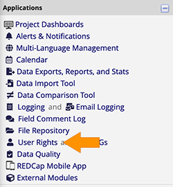

# Data Science Tapas

## REDCap to R Markdown, reproducibly

February 16, 2023

### Description:

REDCap is an electronic data capture software that is widely used in the academic research community. You can interact with REDCap from an R environment through its API (application programming interface). Interaction with our REDCap data through an R environment allows us to increase the reproducibility of our reports in R Markdown.

In this session of Data Science Tapas, we will explore how to go from REDCap to reproducible R Markdown reports through R packages and the REDCap API.

Check out the [slides](https://hidyverse.github.io/redcapAPI).

### Take Away:

`rmarkdownReport.rmd` is an example clinical study report that can be edited with your credentials for your own REDCap reporting.

### Possible Workflow:

1.  Check out [UArizona's REDCap Resources](https://cb2.uahs.arizona.edu/redcap)

2.  Create a REDCap Project

    [These instructions](https://kb.iu.edu/d/bdhr) are helpful. Find descriptions of all the template projects (which can be especially helpful in getting started) at step 4.

3.  Design your project

    Edit your surveys and move your project to production.

4.  Collect Data!

5.  Ensure designated users have API rights

::: columns
::: {.column style="width: 45%;"}

:::

::: {.column style="width: 45%;"}

:::
:::

Read about REDCap's API and API playground in this [great blog post](https://education.arcus.chop.edu/redcap-api/) by Joy Payton at CHOP.

5.  Generate an API token

After clicking on the newly populated "API" button in the Applications menu, you'll be prompted to generate an API token.

Copy this token, you'll need it in the next step.

6.  Add your token to your .Renviorn file

Use `usethis::edit_r_environ()` and copy your token to the populated file as something like, `redcap_api_token="1A2B3CXXYYZZOOMMGOSHNOOOOX1Y2Z3"`

Read this [vignette from the `tidyREDCap` package](https://raymondbalise.github.io/tidyREDCap/articles/useAPI.html) for more details.

7.  Export REDCap data to R

Using either REDCap's API playgroud to generate code, [one of the many R packages designed to help you interact with REDCap](https://redcap-tools.github.io/projects/), or the code provided in `rmarkdownReport.rmd`, export your REDCap data at the top of your R Script or directly in the console.

You may notice the API playground gets clunky very quickly with complex projects and this is where packages can be especially helpful.

**NEVER TYPE YOUR TOKEN DIRECTLY INTO YOUR CODE**
